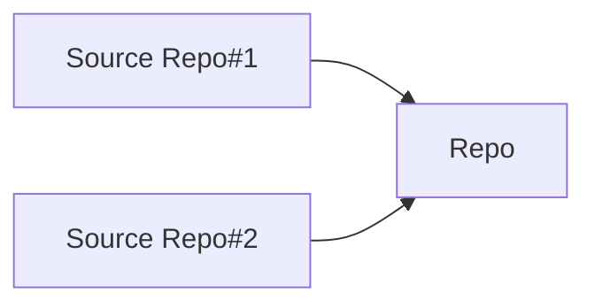

# Repo File Sync

This action will synchronizes files from the specified repository and creates a Pull Request with generated GitHub App token.

## Architecture

This action synchronizes files from the source repository to the repository where using that.  



## Usage

Create `.github/repo-file-sync.yaml`.
This file contains the settings for repositories and files to be copied from.

```yaml
# .github/repo-file-sync.yaml
StudistCorporation/common:
- .github/workflows/labeler.yaml
- .github/ISSUE_TEMPLATE/
StudistCorporation/k8s-common:
- aqua.yaml
```

And create workflow.

```yaml
# .github/workflows/repo-file-sync.yaml
steps:
  sync:
    runs-on: ubuntu-latest
    steps:
      - uses: actions/checkout@v3

      - name: Generate token
        id: generate_token
        uses: actions/create-github-app-token@v1
        with:
          app-id: ${{ secrets.APP_ID }}
          private-key: ${{ secrets.PRIVATE_KEY }}
          owner: ${{ github.repository_owner }}

      - name: Sync files
        uses: ./.github/actions/sync-files
        with:
          token: ${{ steps.generate_token.outputs.token }}
          username: john
          email: john@example.com
```

## Inputs

### token

The `token` to used for authenticating with GitHub.

### username

The `username` to use in the git commit.

### email

The `email` to use in the git commit.

### reviewers

The `reviewers` to use in the pull request to be created.
If you specify a team, specify it to `team_reviewers` instead of `reviewers`.

### team_reviewers

The `team_reviewers` to use in the pull request to be created.
If you specify a user, specify it to `reviewers` instead of `team_reviewers`.

### work_ref

The `work_ref` to use in a branch for the pull request to be created.
